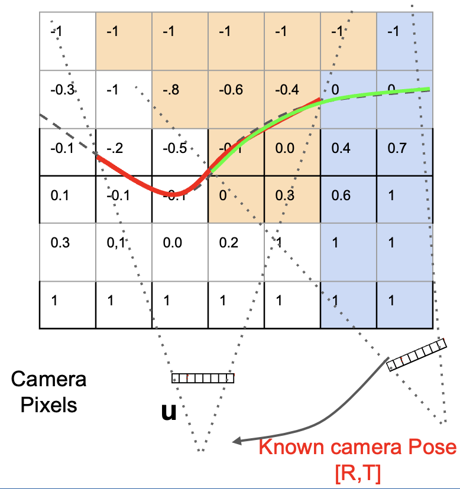

# Multi-view TSDF for 3D Reconstruction
3D reconstruction via multi-view TSDF

<p align="center">
    <video src = "supplemental/walle_pc.mp4" width="300" height="auto" />
    <video src = "supplemental/walle_mesh.mp4" width="300" height="auto" />
</p>

## Installation
To run this repository, install all the python dependencies using the provided <b>requirements.txt</b> file.
```bash
pip install -r requirements.txt
```
You can run the multi-view TSDF algorithm by executing the <b>tsdf_run.py</b> file which will produce the resulting point cloud and 3D mesh inside the <b>supplemental</b> folder.

## Brief Summary 
Inside the <b>data</b> folder are RGB-D image files, and its corresponsing pose information. The poses are used to perform $$SE(3)$$ transformations, which allows the voxel values to be updated every frame.
<p align = "center">
    
</p>


